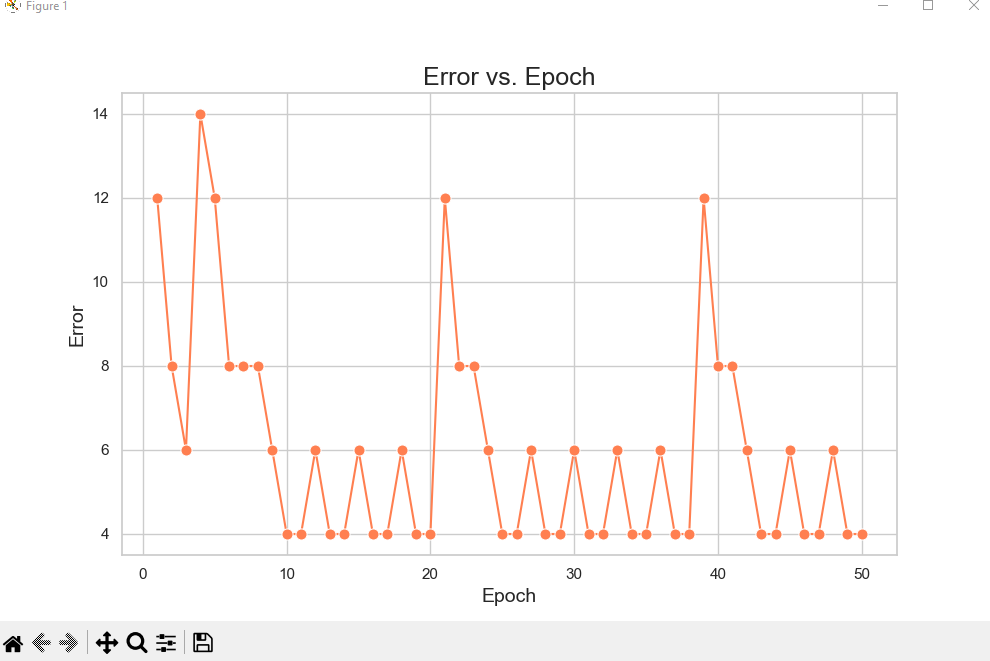
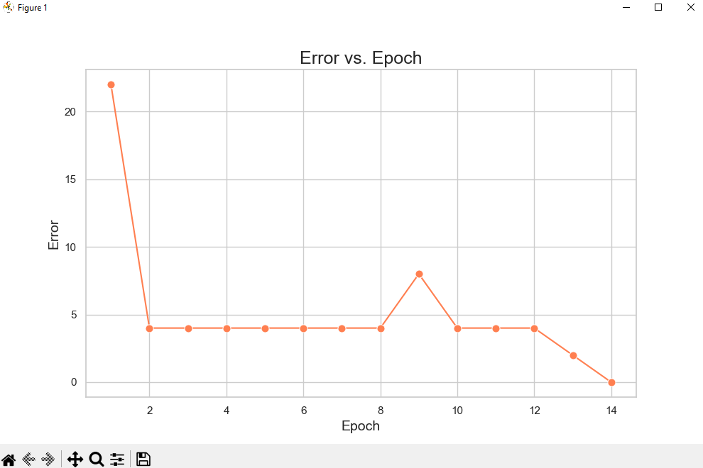
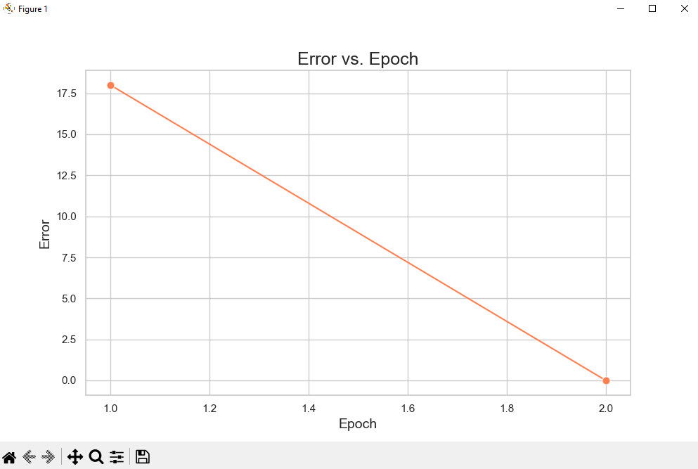
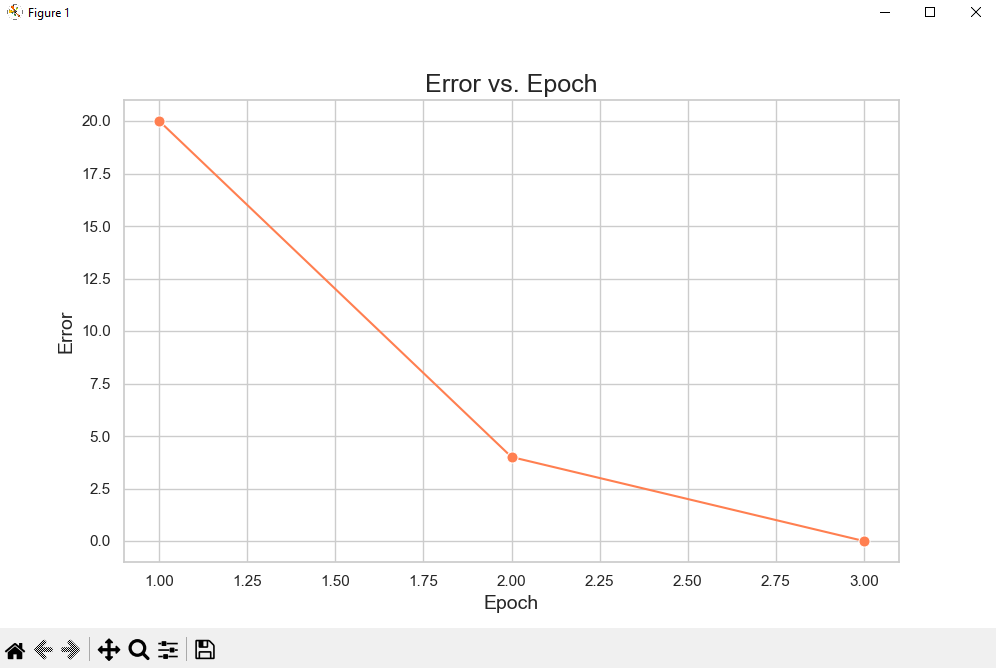
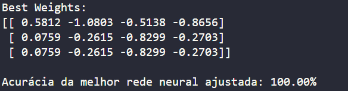

### Integrantes:
Henrique Pereira Cristófaro
Vitor Theodoro Rocha Domingues

# Enunciado

## Implementar um Perceptron com o Algoritmos Genético para Predizer a classe da planta iris

### a) Usar com função de ativação a função sigmoidal. Para a função sigmoidal, computar a classe para saída que apresentar o maior valor.
### b) Substituir a etapa de atualização de pesos da redes neural (método Gradiente) por um algoritmo genético.
### c) Representar como saída a curva erro x época da melhor rede neural.
### d) Mostrar a acurácia da melhor rede neural ajustada.

### Gráfico 1

### Gráfico 2

### Gráfico 3

### Gráfico 4

### Saída no terminal

